# Hoverboard Hack Instructions

Les instructions suivante permettent un contrôle à distance d'un hoverboard muni d'un microcontrôleur du type MM32SPIN0X et plus précisément ce hoverboard
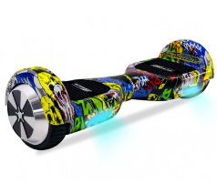

## La Batterie du hoverboard doit être débranchée durant la suite des opération et les cartes non alimentée.

Pour commencer, Il vous télécharger ces logiciels :

keil uvison 5 : https://www.keil.com/download/product/
puTTY : https://www.chiark.greenend.org.uk/~sgtatham/putty/latest.html

Commencez par identifier les deux cartes, une master et l'autre Slave.
La master est la carte reliée au bouton power du hoverboard et la carte slave possède le buzzer. Vous pouvez aussi vous référer à ces images :

Carte Master :
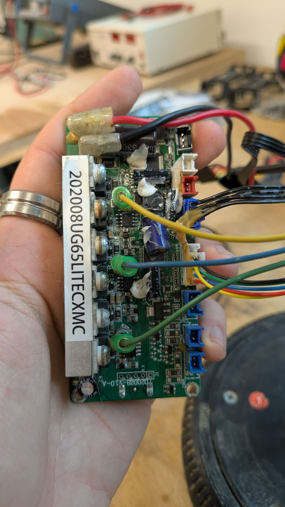

Carte Slave :
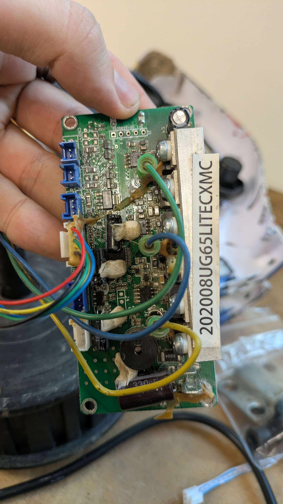

Munissez vous ensuite d'une une clé usb de type ST-LINK v2, tel que celle ci :

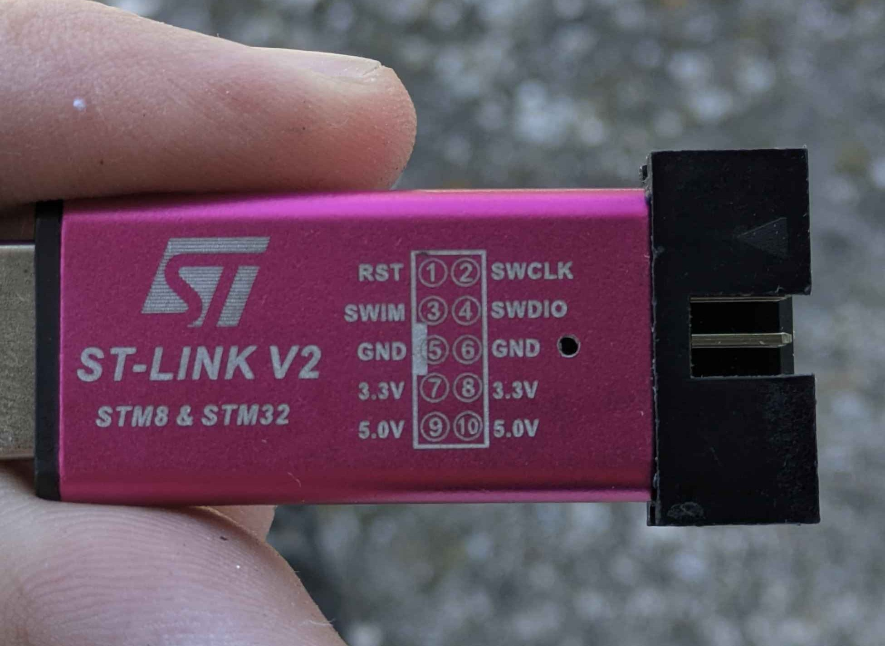

Pour l'utiliser vous aurez probablement besoin d'un driver téléchargeable ici :
https://www.st.com/en/development-tools/stsw-link009.html

Une fois tout ceci fait, rechercher d'abords sur votre carte master 5 trou noté : D,R, C, 3.3, G situé sur une des extremités de votre carte. Branchez votre ST-LINK v2 de la manière suivante :

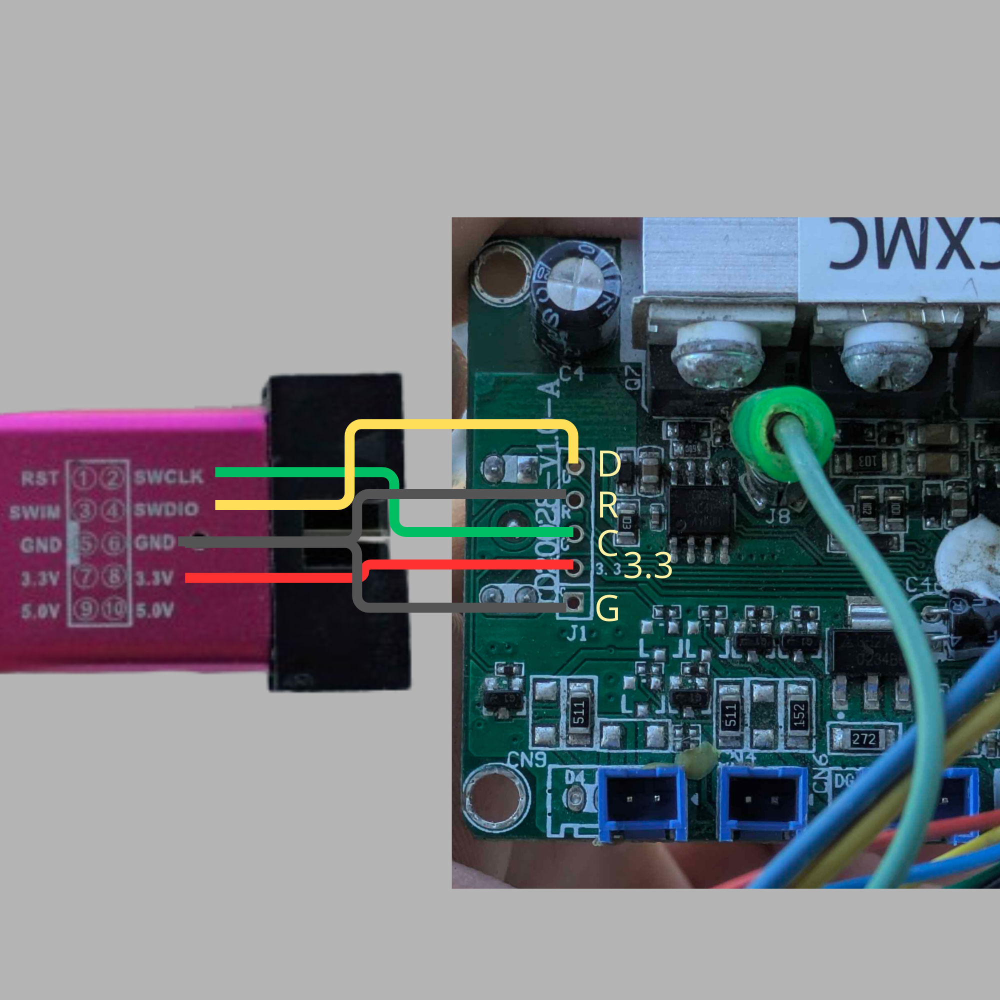

Vous pouvez désormais dézipper le fichier Hoverboard-Firmware-Hack-Gen2.x-MM32-pin-finder.zip et ouvrir le fichier .uvprojx avec keil uvision5

Une fois dans keil uvison5, il vous faut tout d'abord vérifier que le bon type de microcontrôleur est sélectionné, comme sur cette image:

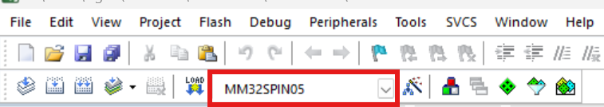

Vous pouvez ensuite vous assurer que après avoir cliqué sur ce bouton:

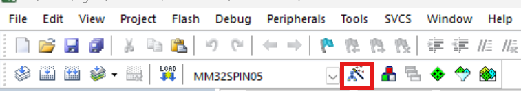

Puis en allant dans l'onglet debug que vous utilisez bien le ST-Link Debugger. Puis en allant dans settings :

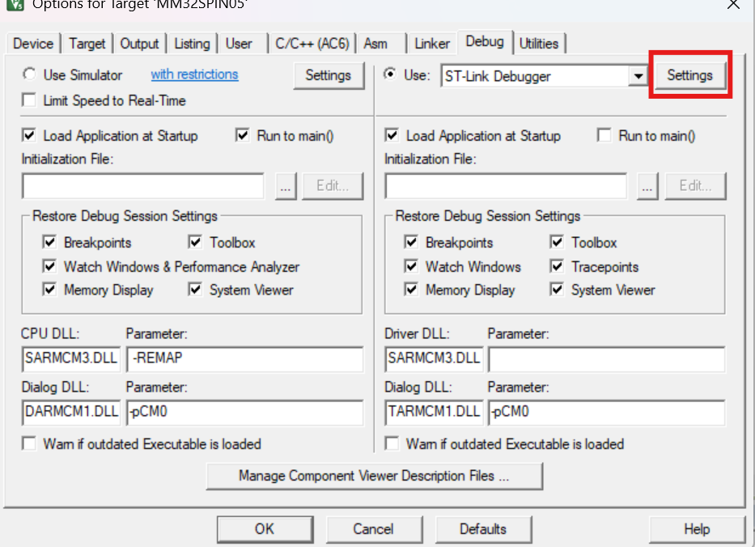

Puis dans l'onglet Flash Download, que vous avez activé l'option Erase Full chip :

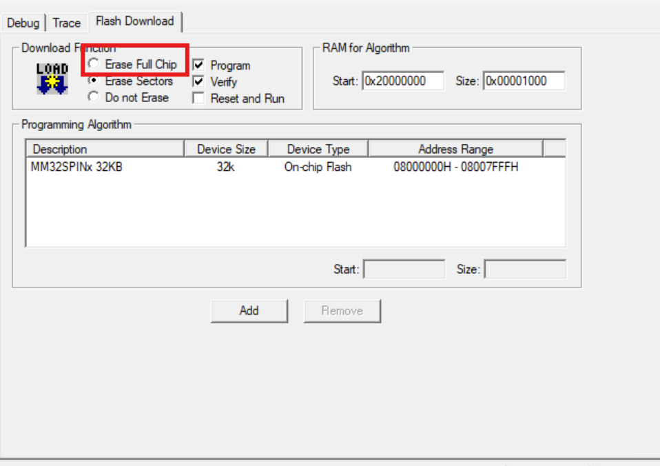

Une fois fait, cliquez sur Ok jusqu'a fermer les fenêtres que vous avez ouvert. 

Vous pouvez ensuite faire un build du projet en appuyant sur la touche F7 de votre clavier ou bien en cliquant sur build target dans l'onglet Project.

Ensuite dans l'onglet Flash vous pouvez appuyer sur Erase.

# Attention

Lors de cette étape, le fil lié à NReset doit être débranché au cours de l'opération. Débranchez le environ une seconde après avoir cliqué sur Erase. Si l'opération échoue c'est que vous ne l'avez pas débranché dans le bon timing, réalisez l'opération jusqu'à ce qu'elle soit un succès.

Une fois ceci fait, vous pouvez donc réaliser le flash du programme en appuyant sur la touche F8 de votre clavier ou bien en cliquant sur Download dans l'onglet Flash.

# Attention

Il vous faut faire la même manipulation que lors de l'Erase avec le câble lié à NReset.

Une fois cela réalisé, vous pouvez débrancher les cables connectés à votre carte

Vous pouvez ensuite débrancher le cable branché sur le port UART de cable master, la reliant avec la carte Slave.

Vous pouvez ensuite allimenter la carte Master en 24V 1A avec une alimentation externe ou directement utiliser le chargeur du hoverboard branché pour réaliser les manipulations qui vont suivre. 

Commencez par allumer le hoverboard. A cette étape, les LED connectées à la carte Master vont s'allumer pendant une seconde puis se mettre à clignoter très rapidement (si ce n'est pas le cas, éteindre puis rallumer la carte). Lorsque les LED clignotent, il faut se faire toucher les broches Rx et TX du port UART, à l'aide d'un fil par exemple. Une fois fais, les LED vont devenir statiques puis s'éteindre. 

Une fois cette étape passée, vous pouvez utiliser un cable du type TTL-232R-3V3 afin de vous connecter en USB sur le port UART.

# NE CONNECTEZ SURTOUT PAS LA BROCHE 3.3

Ne branchez que la broche GND, RX et TX de l'UART sur vos broches GND, TX et RX de votre cable. 

Lancez PuTTY avec la configuration suivante (Utilisez le port COM lié à votre cable):

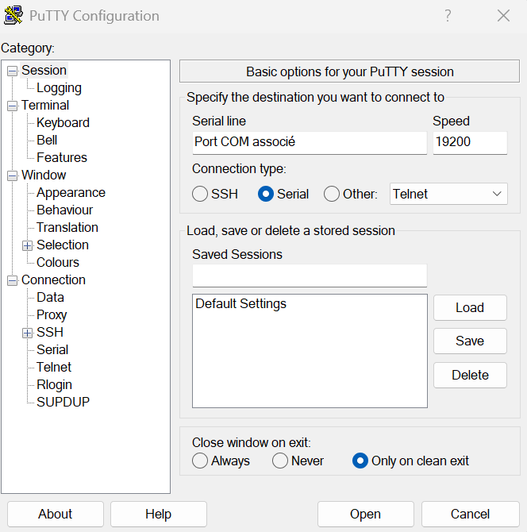

Vous devriez avoir l'affichage suivant : 

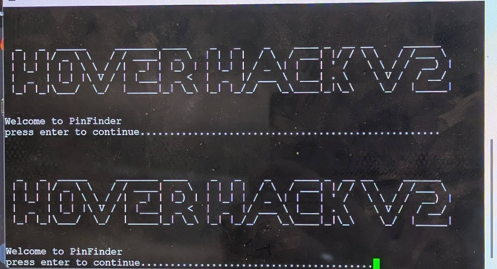

Appuyez donc sur Entrer puis 0, suivez ensuite les instructions sur le terminal.

Pour le Slave ID de cette carte, entrez 0

Une fois cela fait, tapez '7' et allez modifier le paramètre 44 (Drivemode) et passez le à 2.

Vous pouvez tester vos moteurs avec l'option 8 et vérifier qu'ils tournent bien

Une fois tout ceci fait, vous pouvez réaliser l'opération pour la carte Slave, en prenant soin de lui donner 1 comme slave ID. 

# ATTENTION

Lors de l'alimentation de cette carte, pensez à connecter la broche 15V du port UART sur soit une source d'alimentation réglée à 15V ou bien en Récupérant les 15V qui sortent de la broche 15V du port UART de la carte Master. Si cela n'est pas réalisé, la carte ne s'allumera pas lors de l'appui sur le bouton power.

Une fois ce premier flashage réalisé et vos cartes configurées, nous pouvons flasher le main firmware. 

Pour ce faire, dézippez ce zip : Hoverboard-Firmware-Hack-Gen2.x-MM32-main.zip

Débranchez temporairement l'alimentation de votre hoverboard.

Realisez de nouveau les branchement avec le ST-Link pour la carte master.

# Attention

Ouvrez Keil uvision 5 et retournez dans cet onglet mais sélectionnez cette fois ci l'option Erase Sectors, comme sur l'image suivante :

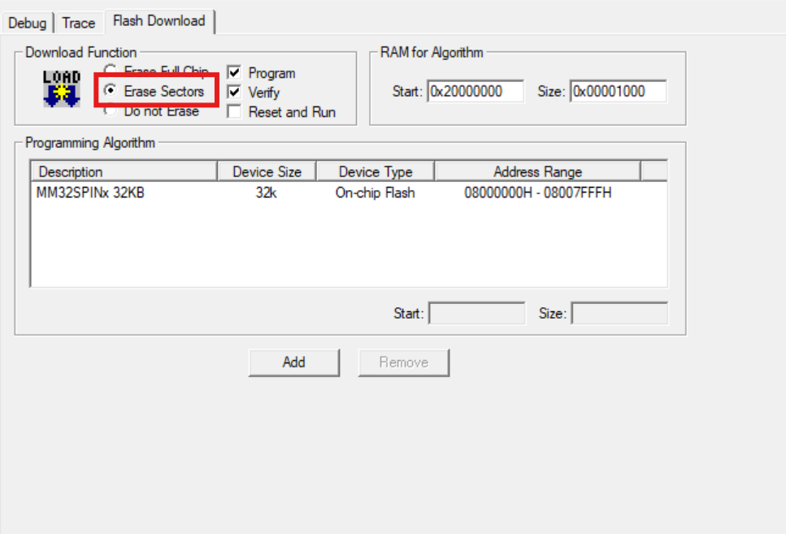

Cette étape est importante car nous souhaitons garder la configuration réalisée à l'étape précédente.

### Il ne faut surtout pas faire d'Erase

Réalisez un build du programme puis Flashez le directement

Réalisez cette opération sur les deux cartes puis débranchez votre ST-Link

Vous pouvez ensuite vérifier que le hoverboard s'allumer correctement (le buzzer devrait emettre un petit son)

Munissez vous ensuite d'un ESP-WROOM-32 et réalisez le câblage suivant :

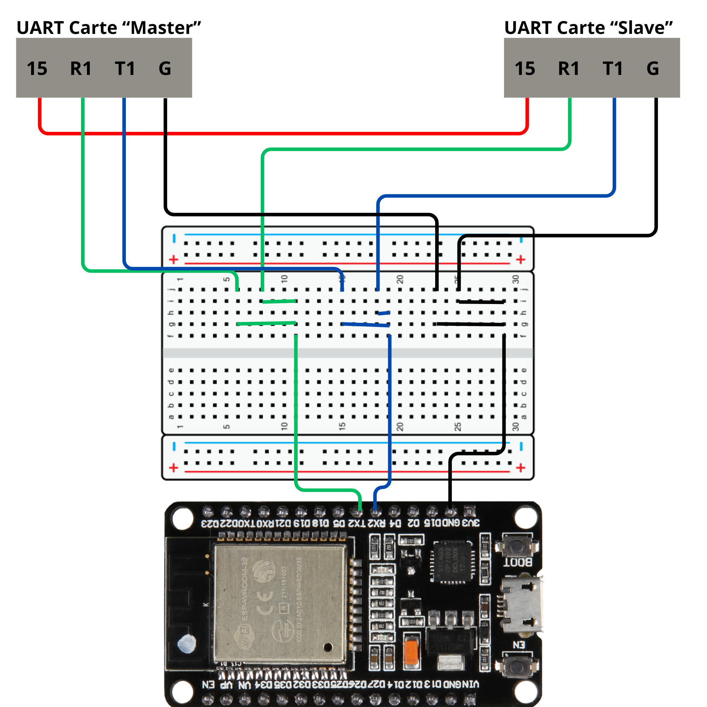

Et programmez votre ESP avec le programme de votre choix !

# Instructions pour les programmes ESP:
Utilisez l'IDE arduino pour programmer l'ESP32 et sélectionnez la carte ESP32 Dev Module. N'oubliez pas de mettre les bibliothèques données dans le même dossier que le programme.

Si vous avez utilisé des Slaves ID différents de 0 pour la carte master et 1 pour la carte Slave, vous pouvez les modifier dans cette ligne : int motors_all[motor_count_total] = {0, 1}; Cependant, le programme pourrait ne tout de même pas marcher.

SpeedTest : Tapez directement dans le terminal (115200 bauds) 'f' pour avancer, 'b' pour reculer, 'l' pour tourner à gauche, 'r' pour tourner à droite et 's' pour arrêter le hoverboard

BT_Speedtest : Connectez vous en bluetooth à l'ESP32 puis utilisez une application du type serial bluetooth Terminal (disponible sur le playstore) pour taper vos commande (même que pour SpeedTest)

Webserveur_controller : Renseignez les paramètres du wifi sur lequel vous voulez vous connecter (ligne 18 et 19) puis rendez vous sur un moteur de recherche. Recherchez http://hoverboard.local pour accéder à la manette. Si vous hébergez le hotspot wifi depuis l'appareil sur lequel vous tentez d'accéder à la manette, il se peut que cela ne fonctionne pas, auquel cas regardez les appareils connectés au wifi et accédez à la manette directement depuis l'IP de l'ESP32 (l'IP est aussi donnée dans le terminal de l'IDE arduino).

